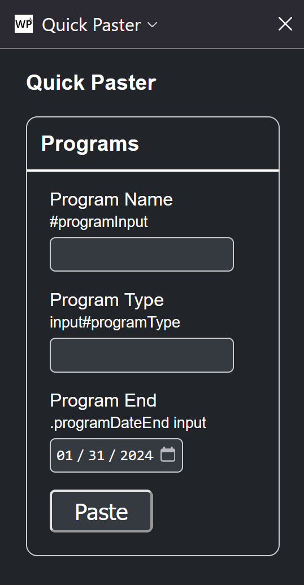

# WPUtils
This is a firefox web extension for simultaneous development in UAT and Production environments wordpress development on different domains. 

It's main features are:
* allow copying elements from WPBakery to and from separate domains
* a paster that lets you configure multiple forms with JSON for quick pasting with CSS Selectors and multi language values (Open with CTRL+SHIFT+F1 or on extensions toolbar as a popup)
* and allows you to configure 2 different domains so by right clicking on the tab and pressing Open in opposite you can quickly open the equivalent page at the different domain

I add stuff as I need it, if a task is very repetitive I'll probably implement it here.

## Loading the addon
This is very much a work in progress so it is not packaged yet. To load it you'll have to go to the about:debugging#/runtime/this-firefox (on firefox) and load it as a temporary add on.

Preconfigure the WP domains in the addons Options page and optionally add "Quick Paster Form Descriptors" which are the form input elements described in JSON for the quick paster.

## Options page

Go to about:addons, then click on the extension and the options tab. There you'll be able to configure the domains for switching environments as well as the Quick Paster Form Descriptors for pasting.

## Quick Actions

There are currently two quick actions "Find Empty Ammendments" and "Find empty SubContractor" clicking these buttons will quickly find and scroll to the first empty field so the user can edit them quickly. It finds the field with a query selector string which is currently not configurable, but popup.js line 353 contains the caling function.

## Quick Paster

The quick paster allows you to quickly paste data into input elements by specifying CSS selectors (one or many) for the input and the values you want to paste. It was designed to solve filing out the same data multiple times on diffrent pages. 

You can open the Quick Paster sidebar with CTRL+SHIFT+F1 or in the extensions toolbar as a popup.

If you don't see any forms in the quick paster you must add them in the options page.

An example of the descriptors are as follows:
```
{
	"Forms": [
	    {
	        "name": "Programs",
	        "multi_lang": "true",
	        "fields": [
	            {
	                "field_name": "Program Name",
	                "CSS_Selector": ["#programInput", "input.programName"],
	                "es_value" : "Programa A",
	                "en_value" : "Program A",
	                "type": "text"
	            },
	            {
	                "field_name": "Program Type",
	                "CSS_Selector": "input#programType",
	                "type": "text"
	            },
	            {
	                "field_name": "Program End",
	                "CSS_Selector": ".programDateEnd input",
	                "type": "date",
	                "value": "2024-01-31"
	            }
	        ]
	    }
	]
}
```

You don't need to include the value field, this would simply leave the field empty so you can configure it in the sidebar/popup.

Adding the value field just initializes the quick paster with that value. Since the quick paster has persistence any change to the default value will be overrun until new descriptors are submitted in the options page.

The multi_lang field set to "true" ensures the side bar form will contain to input fields, one for english and one for spanish. It will paste the value that corresponds with the page language, the page language defaults to spanish, else it is set to english with the lang query within the url when "lang=en".

The type field corresponds to HTML input types, right now only text and date are supported. This type field is simply for form generation, if you're targeted element contains a value attribute it will still work, since the quick paster just sets the value attribute of the selected element.

The Descriptor above would produce this in the sidebar:



## Build

Make sure you have web-ext installed and run ``` web-ext build ``` in the repo directory.

### To do

Think i might do most of the logic in JQuery since it might be simpler. Works great so far. 