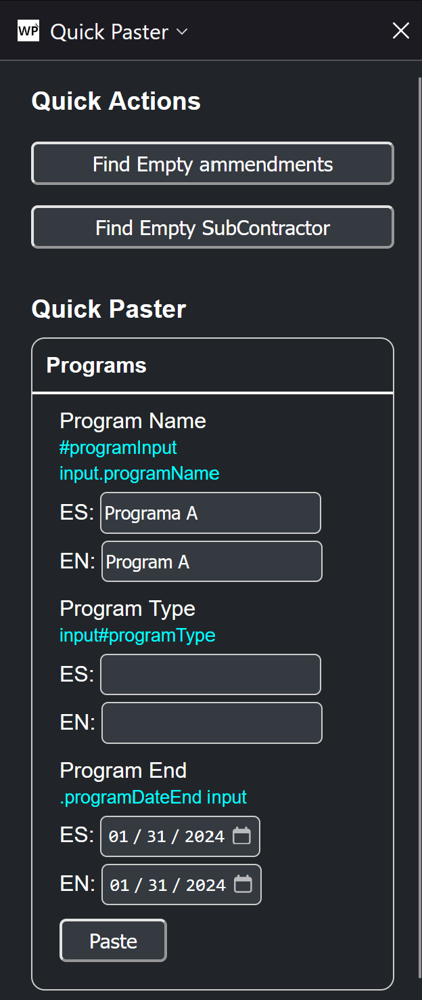

# WPUtils
This is a firefox web extension for simultaneous UAT and Production environments wordpress development on different domains. 

It's main features are:
* allowing copying elements from WPBakery to and from separate domains
* a paster that allows you to configure multiple different forms with JSON for quick pasting
* and allows you to configure the 2 different domains so by right clicking on the tab and pressing Open in opposite you can quickly open the equivalent page the different domain

I add stuff as I need it, if a task is very repetitive I'll probably implement it here.

## Loadind the addon
This is very much a work in progress so it is not packaged yet. To load it you'll have to go to the about:debugging#/runtime/this-firefox (on firefox) and load it as a temporary add on.

Preconfigure the WP domains in the addons Options page (about:addons, then click on the addon and go to options) and optionally add what i call "Descriptors" which are the forms for the quick paster. 

## Quick Paster

**This next section is subject to change very soon as the JSON structure really needs redoing.**

The basic format of the Paste Descriptors are as follows:

    "Descriptor": [
        {
            "name": "Form1",
            "fields": [
                [
                    ".CSS_SELECTOR_FOR_INPUT_FIELD",
                    "VALUE"
                ],
                [
                    "#email",
                    "example_email@example.com"
                ],
                [
                    "input.ProgramField",
                    "NASA"
                ]
            ]
        },
        {
            "name":"AnotherForm",
            "fields":[
                ["#CSSSELECTOR","value"]
            ]
        }
    ]

So an object that has a name field and a fields field where the name field is just a string and the fields field has an array of arrays. Each array has a CSS Selector as the first value and a value as the second value in the array. 

Think of the value field as a default, so maybe you would put a year, since the year is unlikely to change quickly. 
Mostly you would leave the values blank so you can configure it in the drop down menu for any form you'd have to fill out multiple times.

The Descriptor above would produce this in the drop down:

